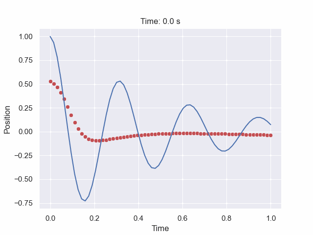

# Physics-Informed Neural Networks (PINNs)

This repository contains three implementations of Physics-Informed Neural Networks (PINNs) for solving differential equations:



## Overview

Physics-Informed Neural Networks (PINNs) are a novel approach to solving differential equations by training neural networks that respect the underlying physics. This repository contains three projects demonstrating different applications of PINNs:

1. **PINNs_GIF**: A Jupyter notebook that generates an animated GIF showing how PINNs learn to approximate the solution of a damped oscillator over time.
2. **PINNs_GUI**: A graphical interface for solving the boundary layer problem in a 2D pipe using PINNs.
3. **iPINNs_GUI**: A graphical interface for solving the inverse boundary layer problem in a 2D pipe, discovering unknown parameter from data points.

## Projects

### PINNs_GIF

A Jupyter notebook that demonstrates PINNs solving a damped oscillator problem, creating an animated GIF of the training process. This visualization shows how the neural network progressively learns to match the analytical solution over training iterations.

### PINNs_GUI

This application provides a graphical interface to visualize how PINNs solve the boundary layer problem in a 2D pipe. Users can adjust parameters like the pipe radius, viscosity, pressure gradient, and learning rate to see how they affect the solution.

**Features:**
- Real-time visualization of PINNs training
- Comparison with analytical solutions
- Interactive parameter adjustment

### iPINNs_GUI

This application provides a graphical interface for inverse Physics-Informed Neural Networks (iPINNs), applied to the same boundary layer problem in a 2D pipe. Unlike regular PINNs that solve equations with known parameters, iPINNs discover unknown parameters from observed data.

**Features:**
- Parameter discovery from data points
- Interactive data point selection
- Real-time visualization of training

## Getting Started

### Clone the Repository

```bash
git clone https://github.com/KevinHaka/Physics-Informed-Neural-Networks.git
```
```bash
cd PINNs
```

### Prerequisites

Install the required Python packages:

```bash
pip install -r requirements.txt
```

### Running the Projects

**PINNs GUI:**
```bash
cd PINNs_GUI
```
```bash
python PINNs_and_GUI.py
```

**iPINNs GUI:**
```bash
cd iPINNs_GUI
```
```bash
python iPINNs_and_GUI.py
```

**PINNs Animation:**
- Navigate to the PINNs_GIF directory
- Open the PINNs.ipynb file in Jupyter Notebook
- Run all cells to generate the animation

## License

This project is licensed under the MIT License - see the [LICENSE](LICENSE) file for details.
